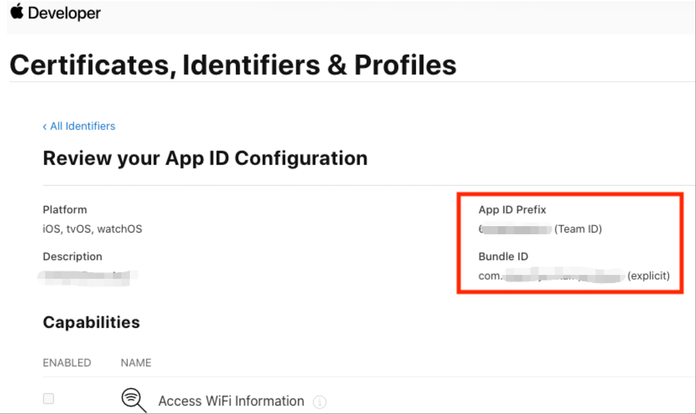

#Universal Link

## Prepare for iOS Universal Links

### Getting the app bundle ID and prefix ID
1. Log into your Apple Developer Account.
1. On the left-hand menu, select Certificates, Identifiers & Profiles.
1. Under Identifiers, select App IDs.
1. Click the relevant app.
1. Copy the prefix ID and app bundle ID.
1. Give the prefix ID and app bundle ID to your marketer.

### Enabling associated domains
To support associated domains in your app:

Follow the [iOS instructions](https://developer.apple.com/documentation/xcode/supporting-associated-domains#Add-the-associated-domains-entitlement-to-your-app) to add the associated domains entitlement to your app

### Register applinks domain
1. Get the subdomain for your app from your marketer.
1. In Xcode, click on your project.
1. Click on the project target.
1. Switch to the Capabilities tab.
1. Turn on Associated Domain.
1. Add the subdomain that you got from your marketer.
The format is applinks:**YOUR\_SUB\_DOMAIN**